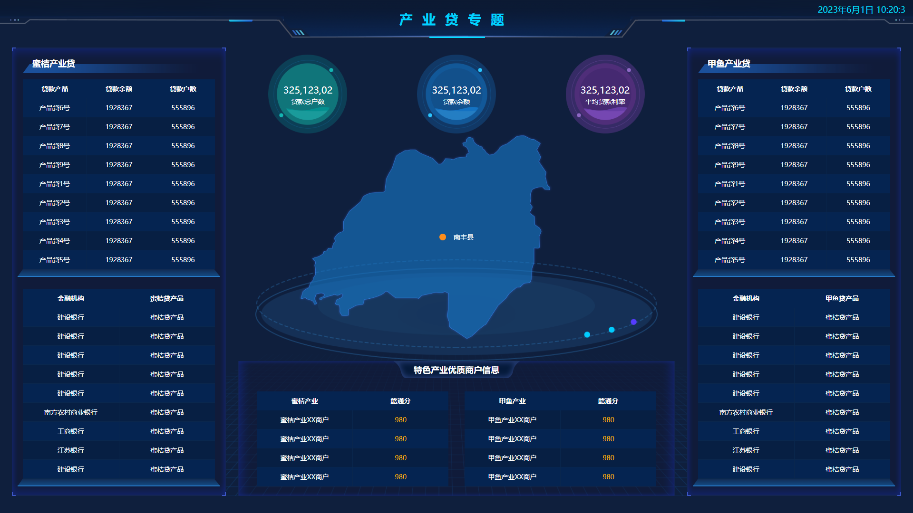
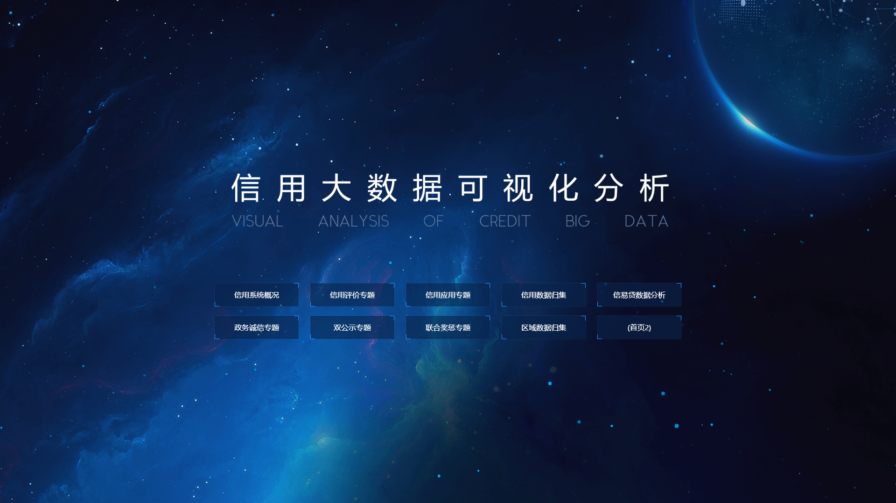

# bigDataPages

#### 介绍
记录工作学习中遇到的大数据页面

#### 页面截图
##### bigData01：

##### bigData02：

##### bigData03：

##### bigData04：

##### bigData05：

##### bigData06：

##### bigData07：

##### bigData08：

##### bigData09：

##### bigData10：

##### bigData11：

##### bigData12：

##### bigData13：

##### bigData14：

##### bigData15：

##### ncloud-ui：

